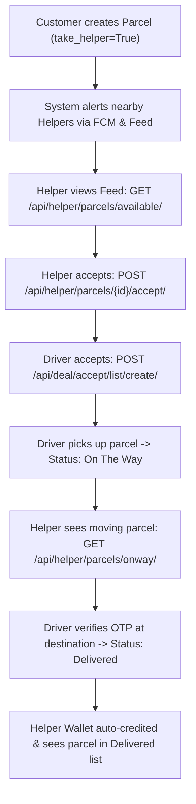

# Helper App API Documentation (Frontend Integration Guide)

> **Base URL:** `https://api.digaxy.com` (Production) / `http://localhost:8000` (Local)  
> **Auth Scheme:** `Authorization: Bearer <access_token>`  
> **Target Audience:** Flutter / React Native / Web Frontend Developers

---

## 1. System & Role Architecture

- **Driver vs Helper:**
  - **Driver:** Owns a vehicle, accepts driver deals, drives, performs pickup (photo uploads), and performs delivery completion (customer OTP verification).
  - **Helper:** Assists movers/customers with lifting, loading, and unloading. Helper **never** executes parcel delivery or OTP verification.
  - **Workflow:** When a customer books a delivery with `take_helper=True`, the request appears on the Helper's feed (`/api/helper/parcels/available/`). Helper accepts it, coordinates with Driver, and receives their earnings (30% share) automatically when the driver completes the delivery.



---

## 2. Authentication & Profile APIs

### 2.1 Helper Signup
Registers a new Helper account.

- **Endpoint:** `POST /api/auth/helper/signup/`
- **Auth Required:** No
- **Headers:** `Content-Type: application/json`

#### Request Body
```json
{
  "username": "karim_helper",
  "email": "karim@example.com",
  "password": "Password123@",
  "phone_number": "+8801700000000"
}
```

#### Response (`200 OK`)
```json
{
  "status_code": 200,
  "success": true,
  "message": "User created successfully.",
  "data": {
    "user": {
      "username": "karim_helper",
      "email": "karim@example.com"
    }
  }
}
```

---

### 2.2 Login
Authenticates Helper and returns JWT tokens with dedicated Helper profile.

- **Endpoint:** `POST /api/auth/login/`
- **Auth Required:** No
- **Headers:** `Content-Type: application/json`

#### Request Body
```json
{
  "email": "karim@example.com",
  "password": "Password123@"
}
```

#### Response (`200 OK`)
```json
{
  "status_code": 200,
  "success": true,
  "message": "Login successful",
  "data": {
    "access": "eyJhbGciOi...",
    "refresh": "eyJhbGciOi...",
    "user": {
      "id": 15,
      "profile_picture": null,
      "username": "karim_helper",
      "email": "karim@example.com",
      "usergender": "Male",
      "full_name": "Karim Ahmed",
      "phone_number": "+8801700000000",
      "date_of_birth": "1998-05-12",
      "role": "Helper",
      "current_location_latitude": 23.8103,
      "current_location_longitude": 90.4125,
      "earn_money": "150.00"
    }
  }
}
```

---

### 2.3 Get Helper Profile
Fetches current Helper profile details.

- **Endpoint:** `GET /api/auth/helper/profile/me/` (or `/api/auth/helper/profile/`)
- **Auth Required:** Yes (`IsHelper`)
- **Headers:** `Authorization: Bearer <access_token>`

#### Response (`200 OK`)
```json
{
  "id": 15,
  "profile_picture": "https://api.digaxy.com/media/profile_pics/user_15/avatar.jpg",
  "username": "karim_helper",
  "email": "karim@example.com",
  "usergender": "Male",
  "full_name": "Karim Ahmed",
  "phone_number": "+8801700000000",
  "date_of_birth": "1998-05-12",
  "role": "Helper",
  "current_location_latitude": "23.810300",
  "current_location_longitude": "90.412500",
  "earn_money": "150.00"
}
```

---

### 2.4 Update Helper Profile
Updates Helper personal information and profile picture.

- **Endpoint:** `PATCH /api/auth/helper/profile/me/`
- **Auth Required:** Yes (`IsHelper`)
- **Headers:** `Authorization: Bearer <access_token>`, `Content-Type: multipart/form-data`

#### Form Data Parameters
| Field | Type | Required | Description |
|---|---|---|---|
| `full_name` | string | No | Helper full name |
| `phone_number` | string | No | Contact phone number |
| `date_of_birth` | date (`YYYY-MM-DD`) | No | Birth date |
| `usergender` | string | No | `Male`, `Female`, or `Other` |
| `profile_picture` | file (image) | No | Profile photo upload |

#### Response (`200 OK`)
Returns updated `HelperSerializer` representation.

---

## 3. Delivery & Parcel Management APIs

### 3.1 Available Helper Requests (Job Feed)
Returns list of available parcels where the mover/customer explicitly requested a helper (`take_helper=True`) and no helper has been assigned yet.

- **Endpoint:** `GET /api/helper/parcels/available/` (alias: `/api/helper/requests/available/`)
- **Auth Required:** Yes (`IsHelper`)
- **Headers:** `Authorization: Bearer <access_token>`
- **Query Params:**
  - `page`: Page number (default: `1`)
  - `page_size`: Page size (default: `10`)

#### Response (`200 OK`)
```json
{
  "count": 1,
  "next": null,
  "previous": null,
  "results": [
    {
      "id": 42,
      "parcel_id": "9b1deb4d-3b7d-4bad-9bdd-2b0d7b3dcb6d",
      "user": 5,
      "delivery_status": "Pending",
      "vehicle_type": "minibox",
      "pickup_date": "2026-10-05",
      "pickup_time": "14:30:00",
      "pickup_user_name": "Rahim Khan",
      "phone_number": "+8801811111111",
      "pickup_address": "House 12, Road 4, Dhanmondi, Dhaka",
      "ping": "23.746500",
      "pong": "90.376000",
      "drop_user_name": "Tania Begum",
      "drop_number": "+8801911111111",
      "drop_address": "House 45, Sector 7, Uttara, Dhaka",
      "ding": "23.868100",
      "dong": "90.398400",
      "take_helper": true,
      "notes": "Fragile furniture, heavy lifting required",
      "special_instructions": "Please arrive 10 mins early",
      "percel_type": "medium",
      "is_paid": true,
      "estimated_distance_km": "18.50",
      "estimated_time_minutes": "45.00",
      "price": "350.00"
    }
  ]
}
```

---

### 3.2 Accept Helper Request
Accepts an open delivery request to assist as Helper.

- **Endpoint:** `POST /api/helper/parcels/<int:id>/accept/` (or `POST /api/helper/deal/accept/`)
- **Auth Required:** Yes (`IsHelper`)
- **Headers:** `Authorization: Bearer <access_token>`

#### Response (`200 OK`)
```json
{
  "message": "You have successfully accepted this helper request.",
  "deal": {
    "id": 18,
    "parcel": 42,
    "driver": null,
    "helper": 15,
    "is_accepted": true,
    "created_at": "2026-10-01T14:40:00Z",
    "parcel_info": {
      "parcel_id": "9b1deb4d-3b7d-4bad-9bdd-2b0d7b3dcb6d",
      "pickup_address": "House 12, Road 4, Dhanmondi, Dhaka",
      "drop_address": "House 45, Sector 7, Uttara, Dhaka",
      "price": "350.00",
      "delivery_status": "Pending",
      "take_helper": true
    },
    "driver_info": null,
    "helper_info": {
      "helper_id": 15,
      "email": "karim@example.com",
      "phone_number": "+8801700000000",
      "full_name": "Karim Ahmed"
    }
  }
}
```

#### Error Responses
- `400 Bad Request`:
  - `{"error": "This parcel does not require helper assistance."}`
  - `{"error": "A helper has already accepted this parcel deal."}`
  - `{"error": "You have already accepted a deal in progress. Please complete it before accepting another."}`
- `404 Not Found`:
  - `{"error": "Parcel not found."}`

---

### 3.3 Cancel Accepted Deal (Withdraw before Pickup)
If an emergency occurs before the parcel is on the way, the helper can release the deal so another helper can be assigned.

- **Endpoint:** `POST /api/helper/parcels/<int:id>/cancel-deal/`
- **Auth Required:** Yes (`IsHelper`)
- **Headers:** `Authorization: Bearer <access_token>`

#### Response (`200 OK`)
```json
{
  "message": "You have successfully withdrawn from this helper delivery."
}
```

#### Error Response
- `400 Bad Request`: `{"error": "Cannot cancel helper assignment when parcel is 'On The Way'."}`

---

### 3.4 Parcel Details (Helper View)
Get full parcel details by ID.

- **Endpoint:** `GET /api/helper/parcels/<int:id>/`
- **Auth Required:** Yes (`IsHelper`)
- **Headers:** `Authorization: Bearer <access_token>`

---

### 3.5 Accepted Parcels List
List of parcels accepted by this helper where driver pickup is pending (`delivery_status == 'Accepted'`).

- **Endpoint:** `GET /api/helper/parcels/accepted/`
- **Auth Required:** Yes (`IsHelper`)
- **Query Params:** `page`, `page_size`

---

### 3.6 On-The-Way Parcels List
List of active deliveries currently moving with driver (`delivery_status == 'On The Way'`).

- **Endpoint:** `GET /api/helper/parcels/onway/` (alias: `/api/helper/onway-parcels/`)
- **Auth Required:** Yes (`IsHelper`)
- **Query Params:** `page`, `page_size`

---

### 3.7 Delivered Parcels History
List of completed deliveries where helper assisted (`delivery_status == 'Delivered'`).

- **Endpoint:** `GET /api/helper/parcels/delivered/`
- **Auth Required:** Yes (`IsHelper`)
- **Query Params:** `page`, `page_size`

---

### 3.8 Cancelled Parcels
Parcels where this helper was assigned but the order was cancelled.

- **Endpoint:** `GET /api/helper/parcels/cancelled/`
- **Auth Required:** Yes (`IsHelper`)

---

## 4. Earnings, Wallet & Payout APIs

### 4.1 Helper Earnings Summary
Returns helper earnings, total deliveries count, and recent job earnings breakdown.

- **Endpoint:** `GET /api/helper/earnings/`
- **Auth Required:** Yes (`IsHelper`)
- **Headers:** `Authorization: Bearer <access_token>`

#### Response (`200 OK`)
```json
{
  "total_earnings": 105.00,
  "total_deliveries_assisted": 3,
  "recent_deliveries": [
    {
      "parcel_id": 42,
      "parcel_uuid": "9b1deb4d-3b7d-4bad-9bdd-2b0d7b3dcb6d",
      "pickup_address": "House 12, Road 4, Dhanmondi, Dhaka",
      "drop_address": "House 45, Sector 7, Uttara, Dhaka",
      "price": 350.00,
      "helper_earned": 105.00,
      "date": "2026-10-01T15:20:00Z"
    }
  ]
}
```

---

### 4.2 Wallet Information
Returns current wallet balance and payout eligibility.

- **Endpoint:** `GET /api/wallet/info/`
- **Auth Required:** Yes (`IsDriverOrHelper`)
- **Headers:** `Authorization: Bearer <access_token>`

#### Response (`200 OK`)
```json
{
  "success": true,
  "data": {
    "earn_money": "105.00",
    "currency": "USD",
    "can_payout": true
  }
}
```

---

### 4.3 Request Payout
Requests transfer of earned money to helper's bank account or payment method.

- **Endpoint:** `POST /api/wallet/payout/request/`
- **Auth Required:** Yes (`IsDriverOrHelper`)
- **Headers:** `Authorization: Bearer <access_token>`, `Content-Type: application/json`

#### Request Body
```json
{
  "amount": 100.00,
  "bank_name": "City Bank",
  "account_number": "1234567890",
  "account_holder_name": "Karim Ahmed"
}
```

#### Response (`201 Created`)
```json
{
  "id": 7,
  "user": 15,
  "amount": "100.00",
  "status": "Pending",
  "bank_name": "City Bank",
  "account_number": "1234567890",
  "account_holder_name": "Karim Ahmed",
  "created_at": "2026-10-01T15:30:00Z"
}
```

---

### 4.4 Payout History
List of past payout requests.

- **Endpoint:** `GET /api/wallet/payout/history/`
- **Auth Required:** Yes (`IsDriverOrHelper`)

---

### 4.5 Stripe Connect Onboarding
For automated direct Stripe card/bank transfer payouts.

- **Endpoint:** `GET /api/wallet/stripe-connect/onboard/`
- **Auth Required:** Yes (`IsDriverOrHelper`)

---

## 5. Notifications & WebSockets

### 5.1 In-App Notifications List
- **Endpoint:** `GET /api/notifications/list/`
- **Auth Required:** Yes

### 5.2 Mark Notification as Read
- **Endpoint:** `PATCH /api/notification/read-update/<int:pk>/`
- **Auth Required:** Yes

---

### 5.3 Live GPS Map Tracking (WebSocket)
Helper can connect to the parcel channel to track the driver's real-time vehicle movement on the map:

- **WebSocket URL:** `ws://<domain>/ws/live/location/<parcel_id>/?token=<access_token>`
- **Direction:** Receive-only for Helper (Driver broadcasts coordinates, Helper renders them on Google Maps / Mapbox).

#### Inbound Message format received by Helper
```json
{
  "type": "location_update",
  "latitude": 23.750123,
  "longitude": 90.381234,
  "heading": 45.0,
  "timestamp": "2026-10-01T14:50:00Z"
}
```

---

## 6. Frontend App Screen Mapping Reference

| Screen Name | API Endpoint | Description |
|---|---|---|
| **Login Screen** | `POST /api/auth/login/` | Verify `user.role == 'Helper'` |
| **Home (Job Feed)** | `GET /api/helper/parcels/available/` | Display open requests needing helpers |
| **Job Details Modal** | `GET /api/helper/parcels/<id>/` | View addresses, price, distance |
| **Accept Button** | `POST /api/helper/parcels/<id>/accept/` | Move job to "Active" |
| **Active Jobs Tab** | `GET /api/helper/parcels/accepted/` & `GET /api/helper/parcels/onway/` | See assigned deliveries in progress |
| **Live Map Screen** | `ws://.../ws/live/location/<id>/` | Watch Driver moving towards dropoff |
| **Delivered History Tab** | `GET /api/helper/parcels/delivered/` | List completed jobs |
| **Earnings Tab** | `GET /api/helper/earnings/` | Total earnings & stats |
| **Wallet Screen** | `GET /api/wallet/info/` & `POST /api/wallet/payout/request/` | Balance and withdraw money |
| **Profile Screen** | `GET /api/auth/helper/profile/me/` | Edit personal information |
